<!-- ======================= HEADER ======================= -->

<p align="center">
  
</p>

<!-- ======================= ABOUT ======================= -->


<p align="center">
  
</p>

<p align="center">
  B.Tech Computer Science student passionate about
  <b>Artificial Intelligence, Full-Stack Development, and Problem Solving.</b>
</p>

<p align="center">
  I build AI-powered applications, explore RAG and LLM systems,
  and turn ideas into practical full-stack products.
</p>

---

## 🚀 What I'm Working On

- 🤖 Exploring **Generative AI, LLMs & RAG**
- 🔎 Building **AI-powered applications**
- 💻 Developing **full-stack web applications**
- 🧠 Improving **Data Structures & Algorithms**
- ☁️ Learning **Cloud & AWS**
- 🚀 Turning ideas into real-world projects

---

<!-- ======================= SKILLS ======================= -->

<h2 align="center">🛠️ Tech Stack</h2>

<p align="center">
  
</p>

---

## 📌 Featured Projects

### 🤖 AI & Machine Learning

**[resumerelevance](https://github.com/rampranai-0104/resumerelevance)**  
TypeScript-based project focused on resume relevance and analysis.

**[nexus-news-agent](https://github.com/rampranai-0104/nexus-news-agent)**  
Python-based AI/news agent project.

**[ai-chatbot](https://github.com/rampranai-0104/ai-chatbot)**  
Python-based chatbot project.

---

### 💻 Full-Stack Development

**[OrbitPath](https://github.com/rampranai-0104/OrbitPath)**  
Full-stack application built with JavaScript.

---

### 🧠 Problem Solving

**[DSA-PROBLEMS](https://github.com/rampranai-0104/DSA-PROBLEMS)**  
My collection of Data Structures & Algorithms problems and solutions.

---

## 🌐 Connect With Me

<p align="center">

<a href="https://www.linkedin.com/in/ram-pranai-teja-a6525b367/">
  
</a>

<a href="mailto:2400031614@kluniversity.in">
  
</a>

<a href="https://github.com/rampranai-0104">
  
</a>

</p>

---

## 🎯 Current Focus

```text
AI / ML
  ├── LLMs
  ├── RAG
  ├── Generative AI
  └── AI Agents

Full-Stack
  ├── React
  ├── Node.js
  ├── FastAPI
  └── Databases

Engineering
  ├── Data Structures & Algorithms
  ├── System Design
  ├── Git & GitHub
  └── Cloud / AWS
